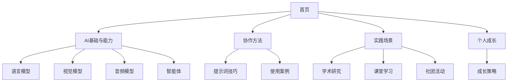

## 1. 产品概述

本产品是一个基于2025年开学AI使用指南的单页网站，旨在为大学生提供系统性的AI工具学习和使用指导。网站将复杂的AI知识体系整理为清晰的分类结构，帮助用户快速找到适合的AI工具并掌握使用方法。

产品目标：让任何AI知识基础的大学生都能在使用网站后建立完整的AI知识地图，在学习、作业等场景中找到最适合的工具。

## 2. 核心功能

### 2.1 用户角色
本产品面向所有大学生用户，无需注册登录，提供开放访问。

### 2.2 功能模块
网站包含以下主要页面模块：
1. **首页导航区**：产品介绍、快速导航菜单
2. **AI基础与能力区**：四大AI类型的详细介绍
3. **协作方法区**：提示词技巧和使用方法
4. **实践场景区**：具体应用场景和工具推荐
5. **个人成长区**：AI驱动的发展策略

### 2.3 页面详情

| 页面名称 | 模块名称 | 功能描述 |
|---------|---------|----------|
| 首页 | 导航头部 | 展示网站标题"大学生AI使用指南"，提供快速跳转菜单 |
| 首页 | 产品介绍 | 展示AI工具的核心理念"AI是强大但普通的工具"，说明使用原则 |
| AI基础区 | 语言模型卡片 | 介绍ChatGPT、DeepSeek等工具的能力、特点和使用场景 |
| AI基础区 | 视觉模型卡片 | 介绍即梦、可灵等图像生成工具的功能和应用 |
| AI基础区 | 音频模型卡片 | 介绍Suno、豆包等音频AI的能力和使用方法 |
| AI基础区 | 智能体卡片 | 介绍Manus、天工等智能体的自动化任务能力 |
| 协作方法区 | 提示词教学 | 展示提示词模板框架，包含角色、目标、任务等要素 |
| 协作方法区 | 案例展示 | 提供吉他社活动策划等具体使用案例 |
| 实践场景区 | 学术研究场景 | 推荐秘塔AI搜索、天工智能体等学术工具 |
| 实践场景区 | 课堂学习场景 | 推荐适合课堂笔记、作业辅助的AI工具 |
| 实践场景区 | 社团活动场景 | 推荐活动策划、海报设计等相关工具 |
| 个人成长区 | 成长策略 | 介绍如何利用AI提升个人技能和影响力 |

## 3. 核心流程

用户访问网站后，可以通过以下流程使用：
1. 首页了解AI基本概念和使用原则
2. 浏览AI基础与能力区，了解四大AI类型
3. 学习协作方法区的提示词技巧
4. 根据具体需求在实践场景区找到合适工具
5. 查看个人成长区制定长期发展计划

## 4. 用户界面设计

### 4.1 设计风格
- **主色调**：科技蓝#2563eb作为主色，白色#ffffff作为背景色
- **辅助色**：渐变紫#8b5cf6到蓝色#06b6d4的渐变效果
- **按钮风格**：圆角按钮，悬浮时有阴影效果和颜色变化
- **字体**：中文使用系统默认字体，英文使用Inter字体，标题18-24px，正文14-16px
- **布局风格**：卡片式布局，响应式网格系统，顶部固定导航
- **图标风格**：使用简洁的线性图标，配合渐变色彩

### 4.2 页面设计概览

| 页面名称 | 模块名称 | UI元素 |
|---------|---------|--------|
| 首页 | 导航头部 | 固定顶部导航栏，渐变背景，白色文字，平滑滚动锚点链接 |
| 首页 | 英雄区域 | 大标题"大学生AI使用指南"，副标题说明，渐变背景动画效果 |
| AI基础区 | 工具卡片 | 4x1网格布局，每个卡片包含图标、标题、描述、特性标签和链接按钮 |
| 协作方法区 | 教学内容 | 左右分栏布局，左侧理论说明，右侧代码示例和案例 |
| 实践场景区 | 场景分类 | 标签页切换设计，每个场景包含工具推荐卡片和使用说明 |
| 个人成长区 | 策略展示 | 时间线布局，展示不同阶段的成长建议和工具推荐 |

### 4.3 响应式设计
网站采用移动优先的响应式设计：
- 桌面端（>1024px）：多列网格布局，充分利用屏幕空间
- 平板端（768-1024px）：调整网格列数，保持良好的阅读体验
- 移动端（<768px）：单列布局，增大触摸区域，优化滚动体验
- 支持触摸手势，优化移动端交互体验