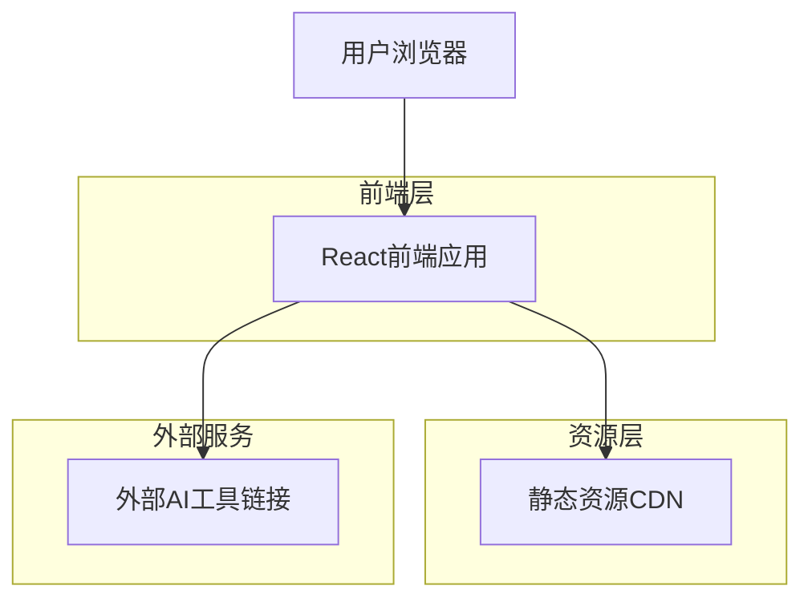

## 1. 架构设计



## 2. 技术描述

- 前端：React@18 + TypeScript + Tailwind CSS + Vite
- 部署：静态网站托管（Vercel/Netlify）
- 无需后端服务

## 3. 路由定义

| 路由 | 用途 |
|------|------|
| / | 主页，包含所有内容区域的单页应用 |
| /#ai-basics | 锚点跳转到AI基础与能力区域 |
| /#collaboration | 锚点跳转到协作方法区域 |
| /#scenarios | 锚点跳转到实践场景区域 |
| /#growth | 锚点跳转到个人成长区域 |

## 4. 组件架构

### 4.1 核心组件结构

```typescript
// 主要组件类型定义
interface AITool {
  id: string;
  name: string;
  category: 'language' | 'vision' | 'audio' | 'agent';
  description: string;
  features: string[];
  link: string;
  icon: string;
}

interface Scenario {
  id: string;
  title: string;
  description: string;
  tools: AITool[];
  examples: string[];
}

interface PromptTemplate {
  role: string;
  goal: string;
  task: string;
  example?: string;
  output: string;
}
```

### 4.2 组件层次结构

```
App
├── Header (导航组件)
├── HeroSection (英雄区域)
├── AIBasicsSection
│   ├── ToolCard (AI工具卡片)
│   └── CategoryFilter (分类筛选)
├── CollaborationSection
│   ├── PromptGuide (提示词指南)
│   └── ExampleCase (案例展示)
├── ScenariosSection
│   ├── ScenarioTab (场景标签页)
│   └── ToolRecommendation (工具推荐)
├── GrowthSection
│   └── StrategyTimeline (策略时间线)
└── Footer (页脚)
```

## 5. 数据模型

### 5.1 AI工具数据结构

```typescript
const aiTools: AITool[] = [
  {
    id: 'deepseek',
    name: 'DeepSeek',
    category: 'language',
    description: '强大的中文大语言模型，擅长对话、写作、编程',
    features: ['对话交流', '文本生成', '代码编写', '逻辑推理'],
    link: 'https://deepseek.com',
    icon: '/icons/deepseek.svg'
  },
  {
    id: 'jimeng',
    name: '即梦',
    category: 'vision', 
    description: '字节跳动推出的AI绘图工具，支持文生图和图生图',
    features: ['文生图', '图生图', '风格转换', '高清放大'],
    link: 'https://jimeng.jianying.com',
    icon: '/icons/jimeng.svg'
  }
  // ... 更多工具数据
];
```

### 5.2 场景数据结构

```typescript
const scenarios: Scenario[] = [
  {
    id: 'academic',
    title: '学术研究 & 论文写作',
    description: '文献检索、论文写作、数据分析等学术场景',
    tools: ['kimi', 'metaso', 'tiangong'],
    examples: [
      '使用Kimi进行文献调研和选题讨论',
      '通过秘塔AI搜索查找专业资料',
      '利用天工智能体生成研究报告'
    ]
  }
  // ... 更多场景数据
];
```

## 6. 交互设计规范

### 6.1 悬浮效果实现

```css
/* 工具卡片悬浮效果 */
.tool-card {
  @apply transition-all duration-300 hover:shadow-lg hover:-translate-y-1;
}

.tool-card:hover .tool-description {
  @apply opacity-100 max-h-40;
}

.tool-card .tool-description {
  @apply opacity-0 max-h-0 overflow-hidden transition-all duration-300;
}
```

### 6.2 平滑滚动导航

```typescript
const scrollToSection = (sectionId: string) => {
  const element = document.getElementById(sectionId);
  if (element) {
    element.scrollIntoView({ 
      behavior: 'smooth',
      block: 'start'
    });
  }
};
```

## 7. 性能优化策略

- 使用React.lazy()进行组件懒加载
- 图片资源使用WebP格式并提供fallback
- 实现虚拟滚动优化长列表性能
- 使用Intersection Observer API实现滚动动画
- 静态资源CDN加速
- 代码分割和Tree Shaking减少包体积